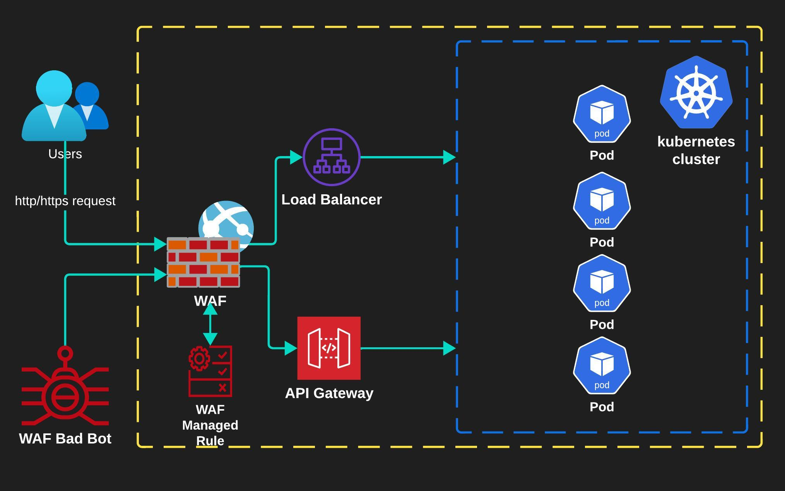

# DevSecOps Challenges Profile Company

### 1.1 Настройка SSH: Напишите пример безопасной конфигурации SSH сервера для входящих подключений из внешней сети. 

> sshd configuration file

```sh
# меняем стандартный порт
Port 2233 
# по лучшим практикам используем статичные адреса, разрешаем только их 
ListenAddress 36.100.45.85

# отключаем вход от root
PermitRootLogin no

# разрешаем только определенным пользователям группам подключаться (при этом нужно создать пользователей, сгенерировать и разослать ключи  данных пользователей, пользователи должны прописать конфиг для подключения к ssh серверу 	~/.ssh/config :
Host <ssh-server>
    HostName <ssh_server_ip>
    User <username>
    IdentityFile ~/.ssh/id_rsa)

AllowUsers user1 user2
# AllowGroups sshusers

# отключаем вход по паролю и логину
PasswordAuthentication no

# включаем вход по публичному ключу
PubkeyAuthentication yes

# определяем директорию где храняться публичные ключи пользователей которые могут подключиться
AuthorizedKeysFile      .ssh/authorized_keys


# отключаем пустые пароли
PermitEmptyPasswords no

# (защищаемся от ddos) ставим лимит одновременных подключений 
MaxSessions 10

#(защищаемся от ddos) ставим ограничение одновременных подключений с 1 IP/процент не прошедших аутентификацию подключений (те 30% из 10 = 3 не аутентифицировано значит новые отбрасываем) / 60 время в секундах
MaxStartups 10:30:60

# вклюячаем реверс резолв ssh сервером клиента для защиты от спуфинга аутентификации
UseDNS yes

# включаем только ssh версии 2 протокол
Protocol 2

# определяем защищенные алгоритмы шифрования
Ciphers aes256-gcm@openssh.com, chacha20-poly1305@openssh.com, aes256-ctr, aes192-ctr, aes128-ctr
MACs hmac-sha2-256-etm@openssh.com, hmac-sha2-512-etm@openssh.com, hmac-sha2-256,hmac-sha2-512
KexAlgorithms curve25519-sha256@libssh.org, diffie-hellman-group-exchange-sha256

# ставим тайм-ауты проверки бездействия
LoginGraceTime 30s
ClientAliveInterval 300
ClientAliveCountMax 0

# отключаем форвардинг через данный сервер (при настройке в качестве сервера бастион включаем)
AllowTcpForwarding no
AllowAgentForwarding no

#мониторим логи подключений и попытки изменения в файловой системе полностью
LogLevel VERBOSE
SyslogFacility AUTH
Subsystem sftp  /usr/lib/ssh/sftp-server -f AUTHPRIV -l INFO

# определяем размещение ключей хоста
HostKey /etc/ssh/ssh_host_rsa_key
HostKey /etc/ssh/ssh_host_ecdsa_key
HostKey /etc/ssh/ssh_host_ed25519_key

# также опционально можем включить MFA от google, установив 
(apt) libpam-google-authenticator  (yam,dnf) google-authenticator

# добавляем правило для MFA
ChallengeResponseAuthentication yes
AuthenticationMethods publickey,keyboard-interactive
```

### 1.2 Напишите пример конфигурации SSH для bastion host (SSH jump server). Необходимо указать параметры, отличные от default.

Настройки для безопасного подключения пользователей выше оставляем и добавляем:

```sh
# отключаем форвардинг через данный сервер 
AllowTcpForwarding no
AllowAgentForwarding no
PermitTTY no
X11Forwarding no
PermitTunnel no
GatewayPorts no

# отключаем удаленное выполнение команд
ForceCommand /usr/sbin/nologin
```

Тестим подключение:

```sh
ssh -J <jump server> <remote server>
```

**Для обеспечения безопасности при развертывании bastion сервера требуется дополнительно обратить внимание на следующие опции:**

* Выбираем дистрибутив с минимальным содержанием предустановленных пакетов, программ, библиотек (например Debian minimal не имеет 3rd party components), это уменьшает возможную поверхность атак на данный сервер.
  
* Настраиваем фаервол компании (облака), а также внутренние сервисы OS iptables, SELinux для доступа только к порту SSH.
  
* При организации доступа в облачном окружении, настраиваем security groups, отключаем все не нужные сервисы в предустановленных дистрибутивах.
  
* Мониторим все! Настраиваем auditd сервера на передачу логов в систему SIEM (не храним локально), ELK, Wazuh agent.

### 2.1 Настройка политик безопасности Kubernetes: Напишите yaml, содержащий: Pod Security Admission (PSA) для указанного namespace. В случае нарушения политики модуль должен запускаться, но с добавлением примечания к событию в журнале аудита.

```yaml
# определяем PSA на уровне кластера k8s
apiVersion: apiserver.config.k8s.io/v1
kind: AdmissionConfiguration
plugins:
  - name: PodSecurity
    configuration:
      apiVersion: pod-security.admission.config.k8s.io/v1beta1
      kind: PodSecurityConfiguration
      defaults:
        enforce: "baseline"
        enforce-version: "latest"
        audit: "privileged"
        audit-version: "latest"
        warn: "privileged"
        warn-version: "latest"
      exemptions:
        usernames: []
        runtimeClasses: []
        namespaces: []
---
# либо на уровне namespace с помощью labels
apiVersion: v1
kind: Namespace
metadata:
  name: psa-privileged-namespace
  labels:
    pod-security.kubernetes.io/enforce: privileged
    pod-security.kubernetes.io/enforce-version: latest
---
apiVersion: v1
kind: Namespace
metadata:
  name: psa-baseline-namespace
  labels:
    pod-security.kubernetes.io/enforce: baseline
    pod-security.kubernetes.io/enforce-version: latest
    pod-security.kubernetes.io/warn: baseline
    pod-security.kubernetes.io/warn-version: latest
---
apiVersion: v1
kind: Namespace
metadata:
  name: psa-restricted-namespace
  labels:
    pod-security.kubernetes.io/enforce: restricted
    pod-security.kubernetes.io/enforce-version: latest
    pod-security.kubernetes.io/warn: restricted
    pod-security.kubernetes.io/warn-version: latest

---
# также определяем что пишем в аудит c определенных namespaces
apiVersion: audit.k8s.io/v1
kind: Policy
omitStages:
  - "RequestReceived"
rules:
  - level: Request
    resources:
      - group: "" # core API group
        resources: ["pods"]
    namespaces: ["psa-privileged-namespace"]
  - level: RequestResponse
    resources:
      - group: "" # core API group
        resources: ["pods"]
      - group: "apps"
        resources: ["daemonsets, deployments, replicasets, statefulsets"]
    namespaces: ["psa-restricted-namespace"]
    verbs: ["create", "update"]
  - level: Metadata
    resources:
      - group: ""
        resources: ["pods/log", "pods/status"]
    namespaces: ["psa-baseline-namespace"]
---
# создаем конфиг ValidatingWebhookConfiguration при валидации запросов с помощью webhook будут добавляться аннотации к аудиту и начинаться значениями заданными в поле имени вебхука - name: "psa-webhook.kubernetes.io"

apiVersion: admissionregistration.k8s.io/v1
kind: ValidatingWebhookConfiguration
metadata:
  name: "psa-webhook.kubernetes.io"

webhooks:
# добавляемая аннотация к логам аудита
  - name: "core.psa-webhook.kubernetes.io"
    failurePolicy: Fail
    namespaceSelector:
      matchExpressions:
        - key: kubernetes.io/metadata.name
          operator: NotIn
          values: ["psa-baseline-namespace, psa-privileged-namespace, psa-restricted-namespace"]
    rules:
      - apiGroups: [""]
        apiVersions: ["v1"]
        operations: ["CREATE", "UPDATE"]
        resources:
          - namespaces
          - pods
    clientConfig:
      caBundle: "/path/to/ca.crt"
      service:
        namespace: "psa-privileged-namespace"
        name: "webhook"
    admissionReviewVersions: ["v1"]
    sideEffects: None
    timeoutSeconds: 5
# добавляемая аннотация к логам аудита
  - name: "apps.psa-webhook.kubernetes.io"
    # Non-enforcing resources can safely fail-open.
    failurePolicy: Ignore
    namespaceSelector:
      matchExpressions:
        - key: kubernetes.io/metadata.name
          operator: NotIn
          values: ["psa-baseline-namespace, psa-privileged-namespace, psa-restricted-namespace"]
    rules:
      - apiGroups: ["apps"]
        apiVersions: ["v1"]
        operations: ["CREATE", "UPDATE"]
        resources:
          - daemonsets
          - deployments
          - replicasets
          - statefulsets
    clientConfig:
      caBundle: "/path/to/ca.crt"
      service:
        namespace: "psa-privileged-namespace"
        name: "webhook"
    admissionReviewVersions: ["v1"]
    sideEffects: None
    timeoutSeconds: 5
```

### 2.2 Network Policies для ограничения доступа между подами, включая разграничение по namespace и labels. Доступ к подам postgres разрешается по порту 5432 только от подов app01 из пространства имен prod. RBAC политику, разрешающую доступ к указанному namespace пользователю Admin с максимальными привилегиями, а пользователю Audit только на просмотр. 

* соответственно у нас должны быть созданы все namespaces и развернуты deployments для pods c соответствущими labels
  
> yaml файл с сетевой политикой

```yaml
# разрешаем ingress подключение к postgres в namespace database из namespace prod от подов app01
apiVersion: networking.k8s.io/v1
kind: NetworkPolicy
metadata:
  name: allow-postgres-from-app01
  namespace: database
spec:
  podSelector:
    matchLabels:
      app: postgres
  policyTypes:
    - Ingress
  ingress:
    - from:
        - namespaceSelector:
            matchLabels:
              purpose: prod
        - podSelector:
            matchLabels:
              app: app01
      ports:
        - protocol: TCP
          port: 5432
---
# запрещаем любой другой ingress к postgresql
apiVersion: networking.k8s.io/v1
kind: NetworkPolicy
metadata:
  name: deny-all
  namespace: database
spec:
  podSelector: {}
  policyTypes:
    - Ingress
```

> yaml файл с политиками доступа RBAC в которых мы создаем роли для админ и аудит пользователя с соответствующими правами доступа для database / prod namespaces

```yaml
apiVersion: rbac.authorization.k8s.io/v1
kind: Role
metadata:
  namespace: database
  name: admin-role
rules:
- apiGroups: [""]
  resources: ["*"]
  verbs: ["*"]

---

apiVersion: rbac.authorization.k8s.io/v1
kind: Role
metadata:
  namespace: prod
  name: admin-role
rules:
- apiGroups: [""]
  resources: ["*"]
  verbs: ["*"]

---

apiVersion: rbac.authorization.k8s.io/v1
kind: Role
metadata:
  namespace: database
  name: audit-read-role
rules:
- apiGroups: [""]
  resources: ["*"]
  verbs: ["get", "list", "watch"]

---

apiVersion: rbac.authorization.k8s.io/v1
kind: Role
metadata:
  namespace: prod
  name: audit-read-role
rules:
- apiGroups: [""]
  resources: ["*"]
  verbs: ["get", "list", "watch"]

---

apiVersion: rbac.authorization.k8s.io/v1
kind: RoleBinding
metadata:
  name: admin-role-binding
  namespace: database
subjects:
- kind: User
  name: Admin
  apiGroup: rbac.authorization.k8s.io
roleRef:
  kind: Role
  name: admin-role
  apiGroup: rbac.authorization.k8s.io

---

apiVersion: rbac.authorization.k8s.io/v1
kind: RoleBinding
metadata:
  name: admin-role-binding
  namespace: prod
subjects:
- kind: User
  name: Admin
  apiGroup: rbac.authorization.k8s.io
roleRef:
  kind: Role
  name: admin-role
  apiGroup: rbac.authorization.k8s.io

---

apiVersion: rbac.authorization.k8s.io/v1
kind: RoleBinding
metadata:
  name: audit-read-role-binding
  namespace: database
subjects:
- kind: User
  name: Audit
  apiGroup: rbac.authorization.k8s.io
roleRef:
  kind: Role
  name: audit-read-role
  apiGroup: rbac.authorization.k8s.io

---

apiVersion: rbac.authorization.k8s.io/v1
kind: RoleBinding
metadata:
  name: audit-read-role-binding
  namespace: prod
subjects:
- kind: User
  name: Audit
  apiGroup: rbac.authorization.k8s.io
roleRef:
  kind: Role
  name: audit-read-role
  apiGroup: rbac.authorization.k8s.io

```

### 3. Настройка Security as Code: Опишите порядок действий по интеграции GitLab SAST в GitLab CI/CD pipeline. Приведите пример необходимых конфигураций для определения целевых объектов сканирования, времени выполнения и получения уведомлений.

### 4. Интеграция сканера уязвимостей (например, OpenVAS): Опишите сценарий интеграции, OpenVAS в GitLab CI/CD pipeline для автоматического сканирования уязвимостей в разрабатываемом приложении, действий по обработке результатов сканирования. Напишите пример yaml для GitLab CI/CD, содержащего скрипт по автоматизированному реагированию на обнаруженные уязвимости.

### 5. Предложите схему интеграции Web Application Firewall (WAF) в инфраструктуре: Напишите конфигурацию для внедрения WAF (например, ModSecurity) в Nginx. Напишите конкретные примеры правил безопасности, которые вы бы применили в WAF (например, фильтрация SQL-инъекций, XSS-атак, блокировка заданных паттернов).



```sh
# installing dependencies

sudo apt install nginx
sudo apt install -y apt-utils build-essential git wget libtool libpcre3-dev zlib1g-dev libssl-dev libxml2-dev libgeoip-dev liblmdb-dev libyajl-dev libcurl4-openssl-dev libpcre++-dev pkgconf libxslt1-dev libgd-dev automake
cd /usr/local/src
git clone --depth 100 -b v3/master --single-branch https://github.com/owasp-modsecurity/ModSecurity
chmod 755 -R ModSecurity/
cd ModSecurity
sudo git submodule init
sudo git submodule update
sudo ./build.sh
sudo ./configure
sudo make
sudo make install
mkdir /usr/local/src/cpg
cd /usr/local/src/cpg
# check your nginx -v (version)
export NGINX_VER=$(nginx -v 2>&1 | cut -d'/' -f2 | cut -d' ' -f1)
# add latest stable version owasp crs modsec
export MODSEC_VER=4.2.0
sudo wget http://nginx.org/download/nginx-$NGINX_VER.tar.gz
sudo tar -xvzf nginx-$NGINX_VER.tar.gz
# Download the source code for ModSecurity-nginx connector
sudo git clone https://github.com/SpiderLabs/ModSecurity-nginx
cd nginx-$NGINX_VER/
sudo ./configure --with-compat --with-openssl=/usr/include/openssl/ --add-dynamic-module=/usr/local/src/cpg/ModSecurity-nginx
sudo make modules
sudo cp objs/ngx_http_modsecurity_module.so /usr/share/nginx/modules/

## configure ModSecurity rules with OWASP CRS (Core Rule Set)
sudo mkdir /etc/nginx/modsec
cd /etc/nginx/modsec
sudo wget https://raw.githubusercontent.com/SpiderLabs/ModSecurity/v3/master/modsecurity.conf-recommended
sudo mv modsecurity.conf-recommended modsecurity.conf
sudo sed -i 's/SecRuleEngine DetectionOnly/SecRuleEngine On/' /etc/nginx/modsec/modsecurity.conf
sudo cp /usr/local/src/ModSecurity/unicode.mapping /etc/nginx/modsec/
sudo cat <<EOF | sudo tee /etc/nginx/modsec/main.conf
# Include the recommended configuration
Include /etc/nginx/modsec/modsecurity.conf
# OWASP CRS v4 rules
Include /usr/local/coreruleset-$MODSEC_VER/crs-setup.conf
Include /usr/local/coreruleset-$MODSEC_VER/rules/*.conf
# A test rule
SecRule ARGS:testparam "@contains test" "id:1234,deny,log,status:403"
EOF

# Add next line to /etc/nginx/nginx.conf
# https://docs.nginx.com/nginx-waf/admin-guide/nginx-plus-modsecurity-waf-installation-logging/

server {
        modsecurity on;
        modsecurity_rules_file /etc/nginx/modsec/main.conf;
}

```sh
sudo wget https://github.com/coreruleset/coreruleset/archive/refs/tags/v$MODSEC_VER.tar.gz
sudo tar -xzvf v$MODSEC_VER.tar.gz
sudo mv coreruleset-$MODSEC_VER /usr/local
cd /usr/local/coreruleset-$MODSEC_VER
sudo cp crs-setup.conf.example crs-setup.conf

sudo systemctl restart nginx
```
* Check that modsecurity rules working
> curl -H "User-Agent: Nikto" http://localhost/

```html
<html>
<head><title>403 Forbidden</title></head>
<body bgcolor="white">
<center><h1>403 Forbidden</h1></center>
<hr><center>nginx/1.18.0</center>
</body>
</html>
```

* В качестве правил безопасности первоначально я бы использовал OWASP CRS, отсекая не релевантные для приложения и дополняя цепочки правил согласно лучшим практикам и тестам, также можно использовать cPGuard rules

> Список правил OWASP CRS

```sh
ubuntu@nginx-modsec:~$ ll /usr/local/coreruleset-4.2.0/rules/
total 884
drwxrwxr-x 2 root root   4096 Apr 24 17:26 ./
drwxrwxr-x 9 root root   4096 Apr 24 12:09 ../
-rw-rw-r-- 1 root root   8997 Apr 23 21:22 REQUEST-900-EXCLUSION-RULES-BEFORE-CRS.conf
-rw-rw-r-- 1 root root  14318 Apr 23 21:22 REQUEST-901-INITIALIZATION.conf
-rw-rw-r-- 1 root root   1637 Apr 23 21:22 REQUEST-905-COMMON-EXCEPTIONS.conf
-rw-rw-r-- 1 root root   2942 Apr 23 21:22 REQUEST-911-METHOD-ENFORCEMENT.conf
-rw-rw-r-- 1 root root   3582 Apr 23 21:22 REQUEST-913-SCANNER-DETECTION.conf
-rw-rw-r-- 1 root root  64233 Apr 23 21:22 REQUEST-920-PROTOCOL-ENFORCEMENT.conf
-rw-rw-r-- 1 root root  21001 Apr 23 21:22 REQUEST-921-PROTOCOL-ATTACK.conf
-rw-rw-r-- 1 root root   4792 Apr 23 21:22 REQUEST-922-MULTIPART-ATTACK.conf
-rw-rw-r-- 1 root root   8078 Apr 23 21:22 REQUEST-930-APPLICATION-ATTACK-LFI.conf
-rw-rw-r-- 1 root root   8876 Apr 23 21:22 REQUEST-931-APPLICATION-ATTACK-RFI.conf
-rw-rw-r-- 1 root root 160066 Apr 23 21:22 REQUEST-932-APPLICATION-ATTACK-RCE.conf
-rw-rw-r-- 1 root root  32404 Apr 23 21:22 REQUEST-933-APPLICATION-ATTACK-PHP.conf
-rw-rw-r-- 1 root root  19631 Apr 23 21:22 REQUEST-934-APPLICATION-ATTACK-GENERIC.conf
-rw-rw-r-- 1 root root  51141 Apr 23 21:22 REQUEST-941-APPLICATION-ATTACK-XSS.conf
-rw-rw-r-- 1 root root  96252 Apr 23 21:22 REQUEST-942-APPLICATION-ATTACK-SQLI.conf
-rw-rw-r-- 1 root root   5580 Apr 23 21:22 REQUEST-943-APPLICATION-ATTACK-SESSION-FIXATION.conf
-rw-rw-r-- 1 root root  22424 Apr 23 21:22 REQUEST-944-APPLICATION-ATTACK-JAVA.conf
-rw-rw-r-- 1 root root   8060 Apr 23 21:22 REQUEST-949-BLOCKING-EVALUATION.conf
-rw-rw-r-- 1 root root   4950 Apr 23 21:22 RESPONSE-950-DATA-LEAKAGES.conf
-rw-rw-r-- 1 root root  15729 Apr 23 21:22 RESPONSE-951-DATA-LEAKAGES-SQL.conf
-rw-rw-r-- 1 root root   3623 Apr 23 21:22 RESPONSE-952-DATA-LEAKAGES-JAVA.conf
-rw-rw-r-- 1 root root   5411 Apr 23 21:22 RESPONSE-953-DATA-LEAKAGES-PHP.conf
-rw-rw-r-- 1 root root   5151 Apr 23 21:22 RESPONSE-954-DATA-LEAKAGES-IIS.conf
-rw-rw-r-- 1 root root  17656 Apr 23 21:22 RESPONSE-955-WEB-SHELLS.conf
-rw-rw-r-- 1 root root   8734 Apr 23 21:22 RESPONSE-959-BLOCKING-EVALUATION.conf
-rw-rw-r-- 1 root root   7546 Apr 23 21:22 RESPONSE-980-CORRELATION.conf
-rw-rw-r-- 1 root root   3017 Apr 23 21:22 RESPONSE-999-EXCLUSION-RULES-AFTER-CRS.conf
```

> config file `/etc/nginx/modsec/main.conf`

```sh
"/etc/nginx/modsec/main.conf" [readonly] 32L, 2596C                                                                                                                                                 1,1           All
# Include the recommended configuration
Include /etc/nginx/modsec/modsecurity.conf
Include /usr/local/coreruleset-4.2.0/crs-setup.conf
Include /usr/local/coreruleset-4.2.0/rules/*.conf
# A test rule
SecRule ARGS:testparam "@contains test" "id:1234,deny,log,status:403"
```

### 6. Конфигурация ELK (EFK): Напишите конфигурацию агентов для сбора и анализа логов приложения в Kubernetes с использованием ELK. Приведите перечень основных событий, которые вы считаете важными для мониторинга информационной безопасности.
